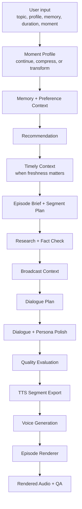

# AI Radio Agent

[](https://www.python.org/downloads/)
[](LICENSE)

A moment-aware AI audio content generation pipeline for personalized daily radio.

AI Radio Agent turns listener context, memory, topic, duration, and time-of-day intent into short two-host radio episodes. It is built as a portfolio demo for AI audio content generation work: planning, dialogue writing, TTS-safe segmentation, voice rendering, and post-render quality checks.

## Demo

### Best First Watch: Yoli's Morning Coffee

<video src="https://github.com/user-attachments/assets/ca8384e8-ba84-4bc2-8b3f-b01a572b87c3"></video>

Best first listen: [04_final_live_texture_mix.mp3](https://github.com/resonantravine/ai-radio-agent/releases/download/demo-audio-v1/04_final_live_texture_mix.mp3)

| Moment | Demo | What to notice |
| --- | --- | --- |
| Breakfast | [Morning Coffee video](https://github.com/user-attachments/assets/ca8384e8-ba84-4bc2-8b3f-b01a572b87c3) / [audio](https://github.com/resonantravine/ai-radio-agent/releases/download/demo-audio-v1/04_final_live_texture_mix.mp3) | Continues one unfinished listener thread with soft morning continuity. |
| Lunch | [Midday Brief video](https://github.com/user-attachments/assets/24b8ee25-7b7d-45f9-a056-6188e91a4849) | Compresses timely context into a short, useful midday explanation. |
| Dinner | [Evening Reset video](https://github.com/user-attachments/assets/f0ac809a-a0b7-4d91-bc91-a1eb6ad5f347) / [audio](https://github.com/resonantravine/ai-radio-agent/releases/download/demo-audio-v1/final_ai_radio_episode_dinner_texture.mp3) | Transforms the day's idea into slower reflection and closure. |

## Listen To The Iterations

The release page includes the recommended review path and the full audio/video iteration sequence, from the first dual-host render to the Breakfast + Lunch + Dinner demo arc.

[Open the demo release page](https://github.com/resonantravine/ai-radio-agent/releases/tag/demo-audio-v1)

## Daily Radio Concept

This prototype treats personal radio as a reusable editorial system, not a one-off podcast script generator. The same pipeline can adapt a listener's memory thread into different short episodes depending on the moment of day.

```text
Breakfast = continue
Lunch     = compress + update
Dinner    = transform
```

| Moment | Show Format | Core Operation | Listener State | Output Feeling |
| --- | --- | --- | --- | --- |
| Breakfast | Yoli's Morning Coffee | Continue | Beginning the day | Gentle continuity |
| Lunch | Yoli's Midday Brief | Compress + update | Between tasks | Useful clarity |
| Dinner | Yoli's Evening Reset | Transform | Winding down | Soft closure |

### Yoli's Midday Brief

<video src="https://github.com/user-attachments/assets/24b8ee25-7b7d-45f9-a056-6188e91a4849"></video>

### Yoli's Evening Reset

<video src="https://github.com/user-attachments/assets/f0ac809a-a0b7-4d91-bc91-a1eb6ad5f347"></video>

## What This Demonstrates

- **Agent orchestration:** each stage has a clear schema, input, output, and retry path.
- **Audio-content planning:** memory, moment, topic, and duration become an editorial brief.
- **Dialogue evaluation:** the system checks liveliness, moment fit, memory use, freshness relevance, semantic density, and TTS readiness.
- **TTS handoff:** production notes are separated from machine-readable speech segments so voice tools do not read labels aloud.
- **Audio rendering:** dual-host clips can be assembled with pauses, loudness control, intro/outro beds, and subtle texture.
- **Post-render QA:** ASR transcript checks compare rendered audio against `tts_segments.json` to catch missing text, label leakage, or audio interference.

## How The Pipeline Works

The pipeline separates user-facing input, editorial planning, dialogue generation, voice handoff, rendering, and post-render checks.



Each agent produces a small JSON artifact in `outputs/`, so the workflow is inspectable instead of hidden inside one prompt. In a real product, the listener only hears the final episode; the generated scripts and JSON files exist for quality control, TTS segmentation, debugging, and evaluation.

## Key Outputs

| File | Why it matters |
| --- | --- |
| `outputs/production_script.md` | Human-readable episode script with speaker, delivery, and production notes. |
| `outputs/tts_segments.json` | Machine-readable speech handoff with speaker, voice key, clean text, delivery note, and pause timing. |
| `outputs/dinner/production_script.md` | Dinner-specific production script showing the transform operation and slower ending. |
| `outputs/dinner/tts_segments.json` | Dinner-specific clean TTS handoff. |
| `docs/demo_iterations.md` | Longer development story and release checklist. |

## Fastest Way To Try It

Mock mode does not require API keys. It creates deterministic planning, script, evaluation, and TTS handoff artifacts.

```bash
python3 -m venv .venv
source .venv/bin/activate
python3 -m pip install -r requirements.txt
python -m ai_radio_agent.run_pipeline --mock
```

Try another moment:

```bash
python -m ai_radio_agent.run_pipeline --mock --moment lunch
python -m ai_radio_agent.run_pipeline --mock --moment dinner
```

Run tests:

```bash
pytest
```

## Optional Voice And QA Paths

The core pipeline works without TTS. Voice rendering is a separate optional layer.

- **Live model providers:** use mock mode for deterministic demos, or configure Gemini/OpenAI in `.env` for live generation.
- **ElevenLabs export:** `python -m ai_radio_agent.tts_elevenlabs --segments outputs/tts_segments.json`
- **Final episode render:** `python -m ai_radio_agent.render_episode --segments outputs/tts_segments.json --audio-dir outputs/elevenlabs_segments --output outputs/final_ai_radio_episode.mp3`
- **ASR quality check:** transcribe rendered audio with `ai_radio_agent.asr_transcribe`, then compare the transcript with `ai_radio_agent.audio_fidelity_check`.

These steps are intentionally optional because the portfolio focus is the controllable content-generation pipeline: editorial planning, dialogue, TTS-safe handoff, rendering hooks, and evaluation.

## Project Structure

```text
ai_radio_agent/
  agents.py              # agent order, prompts, validation, retry, debug logging
  moment_profiles.py     # breakfast/lunch/dinner editorial profiles
  schemas.py             # Pydantic schemas for generated artifacts
  providers.py           # mock, OpenAI, and Gemini provider adapters
  run_pipeline.py        # CLI entry point
  tts_elevenlabs.py      # optional segmented voice export
  render_episode.py      # optional final episode renderer
  asr_transcribe.py      # optional local ASR transcript check
  audio_fidelity_check.py # optional ASR-vs-TTS fidelity report
docs/
  demo_iterations.md     # detailed demo story and release checklist
outputs/dinner/
  production_script.md   # dinner-format production script
  tts_segments.json      # dinner-format TTS handoff
```

## Development Story

This project started as a basic two-host generation pipeline, then added dialogue liveliness, memory continuity, TTS-safe segmentation, and final audio rendering. It now demonstrates a three-moment daily radio arc: Breakfast continues, Lunch compresses and updates, Dinner transforms.

See [docs/demo_iterations.md](docs/demo_iterations.md) for the longer iteration story and release asset guide.

## License

MIT
