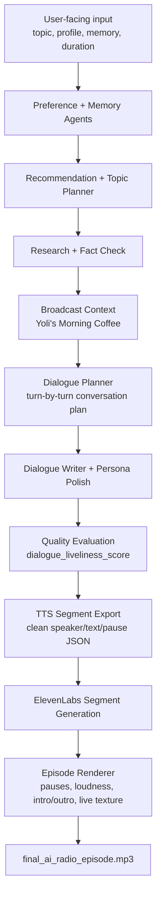

# AI Radio Agent

[](https://www.python.org/downloads/)
[](LICENSE)
[](#run-with-gemini)
[](#elevenlabs-tts)

A portfolio demo for an **AI Agent Engineer | Audio Content Generation** role.

AI Radio Agent turns a listener profile, memory context, topic, and target duration into a personalized two-host AI radio episode. It produces inspectable JSON artifacts, TTS-ready segments, dual-host voice clips, and a final rendered audio episode.

In a real AI podcast product, the user would not write Host A / Host B scripts. These scripts are internal generated artifacts used for quality control, TTS segmentation, persona consistency, and audio rendering.

## Watch The Demo

[04_final_live_texture_mix_npr_style_v2.mp4](https://github.com/resonantravine/ai-radio-agent/releases/download/demo-audio-v1/04_final_live_texture_mix_npr_style_v2.mp4) is the best quick entry point. It shows the final AI radio episode as a clean audio-reactive video card: a soft morning-radio sample with dual AI hosts, memory-aware dialogue, ElevenLabs TTS, subtle breakfast texture, and final audio rendering.

Audio-only version: [04_final_live_texture_mix.mp3](https://github.com/resonantravine/ai-radio-agent/releases/download/demo-audio-v1/04_final_live_texture_mix.mp3)

## At A Glance

- **What it is:** A multi-agent workflow that generates a personalized two-host AI radio episode.
- **What it demonstrates:** agent orchestration, structured JSON artifacts, dialogue quality evaluation, TTS segmentation, and final audio rendering.
- **Demo format:** **Yoli's Morning Coffee**, a soft personal morning radio sample designed for earbuds during breakfast.
- **Best video demo:** [04_final_live_texture_mix_npr_style_v2.mp4](https://github.com/resonantravine/ai-radio-agent/releases/download/demo-audio-v1/04_final_live_texture_mix_npr_style_v2.mp4)
- **Best audio demo:** [04_final_live_texture_mix.mp3](https://github.com/resonantravine/ai-radio-agent/releases/download/demo-audio-v1/04_final_live_texture_mix.mp3)
- **Run locally:** `python -m ai_radio_agent.run_pipeline --mock`

## Daily Radio Concept

This prototype is designed as a reusable personal radio pipeline, not a one-off podcast script generator. The same agent workflow can generate different short episodes for different moments of the day, optimized for earbuds and low-friction listening.

| Moment | Demo Concept | Listening Context | Content Role |
| --- | --- | --- | --- |
| Breakfast | **Yoli's Morning Coffee** | kitchen, coffee, first earbuds session of the day | reconnect with yesterday's unfinished question and offer one useful thread |
| Lunch | **Yoli's Midday Brief** | short walk, lunch break, between tasks | compress useful updates and explain why they matter now |
| Dinner | **Yoli's Evening Reset** | cooking, dishes, low-energy reflection | slow down, connect the day's ideas, and prepare a softer ending |

The current release implements the breakfast demo. Lunch and dinner are planned as follow-up samples using the same internal artifacts: episode brief, segment plan, dialogue plan, TTS segments, audio rendering, ASR transcript, and audio fidelity report.

## Listen To The Iterations

The audio demos are hosted as GitHub Release assets so the code repository stays lightweight.

| Version | Demo | What Changed |
| --- | --- | --- |
| 1. Basic dual-host render | [01_basic_dual_host.mp3](https://github.com/resonantravine/ai-radio-agent/releases/download/demo-audio-v1/01_basic_dual_host.mp3) | First complete two-host pipeline: generated dialogue, segmented ElevenLabs TTS, and assembled mp3. |
| 2. Dialogue liveliness pass | [02_dialogue_liveliness.mp3](https://github.com/resonantravine/ai-radio-agent/releases/download/demo-audio-v1/02_dialogue_liveliness.mp3) | Adds stronger host response, a lived Host A reaction, a concrete Host B metaphor, and remembered context. |
| 3. Morning show identity | [03_morning_coffee_intro.mp3](https://github.com/resonantravine/ai-radio-agent/releases/download/demo-audio-v1/03_morning_coffee_intro.mp3) | Turns the demo into **Yoli's Morning Coffee**, with a softer personal morning-radio opening. |
| 4. Final live texture mix | [04_final_live_texture_mix.mp3](https://github.com/resonantravine/ai-radio-agent/releases/download/demo-audio-v1/04_final_live_texture_mix.mp3) | Final portfolio sample with dual voices, intro/outro music, subtle kitchen texture, and a more live breakfast-at-home feeling. |
| 5. Audio-reactive video card | [04_final_live_texture_mix_npr_style_v2.mp4](https://github.com/resonantravine/ai-radio-agent/releases/download/demo-audio-v1/04_final_live_texture_mix_npr_style_v2.mp4) | A clean, NPR-inspired visualizer video that makes the audio demo immediately legible in a portfolio or GitHub README. |

Release page: [AI Radio Agent Demo Audio](https://github.com/resonantravine/ai-radio-agent/releases/tag/demo-audio-v1)

## What This Project Shows

This project shows the core skills behind AI audio content generation:

- Personalized content planning from listener preferences and memory.
- Modular agent design instead of one giant prompt.
- Internal intermediate representations such as `episode_brief.json`, `segment_plan.json`, `dialogue_plan.json`, and `tts_segments.json`.
- Structured JSON outputs with Pydantic validation.
- A quality and fact-checking step before voice generation.
- A dialogue liveliness evaluation that checks response, tension, clarification, and emotional or experiential movement.
- Clean TTS handoff files that separate human production notes from machine-ready speech text.
- Dual-voice segment generation and final episode rendering.
- Multi-provider LLM support for mock, Gemini, and OpenAI.

## Demo Evolution

This repo includes the pipeline artifacts for a small but realistic iteration story:

```text
basic AI-generated dialogue
-> dual-host segmented TTS
-> more natural host interaction
-> Yoli's Morning Coffee show identity
-> breakfast-at-home live texture mix
```

The key portfolio idea is that a good AI audio agent is not just "one prompt to speech." It needs intermediate planning artifacts, persona control, TTS-safe segmentation, audio rendering, and quality evaluation.

See [docs/demo_iterations.md](docs/demo_iterations.md) for the recommended demo audio sequence and release checklist.

## Sound Direction

The sample show format is **Yoli's Morning Coffee**: a soft personal morning ritual that gives the listener a gentle greeting, reconnects with yesterday's unfinished thread, and offers one useful thought while breakfast is coming together.

The current dialogue prompts intentionally optimize for radio liveliness, not just correctness:

- Host A must include at least one lived reaction from the listener's point of view.
- Host B must use at least one concrete metaphor.
- Each episode should include one specific remembered detail from the previous listening session.

- Calm but not sleepy.
- Personal but not overly intimate.
- Thoughtful but not academic.
- Warm but not sentimental.
- Clear but not over-explaining.
- Not a tech news anchor, productivity coach, marketing narrator, overly cheerful podcast host, or therapist.

## How The Pipeline Works

```text
User Preference Agent
→ Memory Agent
→ Recommendation Agent
→ Episode Brief Agent
→ Segment Planner Agent
→ Topic Planner
→ Research / Fact Check
→ Broadcast Context Agent
→ Dialogue Planner Agent
→ Dialogue Writer
→ Persona Agent
→ TTS Segment Export
→ ElevenLabs Segment Generation
→ Audio Assembler / Episode Renderer
→ final_ai_radio_episode.mp3
```



Each agent produces a small JSON artifact in `outputs/`, so the workflow is easy to inspect, debug, and explain in an interview.

The listener hears a natural two-host radio episode. The interviewer can inspect the agent pipeline behind that episode.

## Fastest Way To Try It

Use Python 3.10 or newer.

Mock mode does not require any API key. It creates inspectable JSON artifacts, a human-readable production script, and TTS-ready segment files in `outputs/`.

```bash
python3 -m venv .venv
source .venv/bin/activate
python3 -m pip install -r requirements.txt
python -m ai_radio_agent.run_pipeline --mock
```

Then inspect:

```text
outputs/production_script.md
outputs/tts_segments.json
outputs/tts_clean_single_voice.txt
```

## Installation Options

Basic local setup:

```bash
python3 -m venv .venv
source .venv/bin/activate
python3 -m pip install -r requirements.txt
cp .env.example .env
```

Install as an editable package with optional extras:

```bash
# Local mock mode + tests
python3 -m pip install -e '.[test]'

# Gemini provider
python3 -m pip install -e '.[gemini]'

# OpenAI provider
python3 -m pip install -e '.[openai]'

# Optional local ASR quality check
python3 -m pip install -e '.[asr]'

# Everything used by the core portfolio demo
python3 -m pip install -e '.[all]'
```

Use `requirements-gemini.txt` if you prefer a beginner-friendly requirements-file flow instead of package extras.

For final episode rendering and local ASR transcription on macOS, install ffmpeg:

```bash
brew install ffmpeg
```

The renderer needs both `ffmpeg` and `ffprobe`, which Homebrew's ffmpeg package normally installs together. `faster-whisper` also uses ffmpeg to decode mp3 and other audio files.

## Run In Mock Mode

Mock mode uses built-in deterministic responses. It does not require any API key.

```bash
python -m ai_radio_agent.run_pipeline --mock
```

You can also pass the user-facing product inputs directly:

```bash
python -m ai_radio_agent.run_pipeline --mock --topic "Why do some AI hosts sound like they really understand you?" --duration-minutes 2
```

Main outputs:

```text
outputs/production_script.md
outputs/episode_brief.json
outputs/segment_plan.json
outputs/tts_segments.json
outputs/tts_clean_single_voice.txt
outputs/tts_elevenlabs_ready.md
```

`production_script.md` is for human review. It includes speaker names, personas, delivery notes, and production metadata.

`episode_brief.json` and `segment_plan.json` show how the system turns a user-facing request into an internal episode structure. For a longer 10–20 minute product version, the segment planner would divide the show into multiple timed sections and generate each section separately instead of asking one prompt to produce a full long script.

`tts_segments.json` is the machine-friendly dual-host handoff. Each segment has:

- `speaker`
- `voice_key`
- `text`
- `delivery_note`
- `pause_after_ms`

`tts_clean_single_voice.txt` is only for quick testing with one voice. It removes speaker labels and delivery notes.

The episode content should sound like a radio program, not a portfolio explanation. For example, the hosts should talk naturally about personalized AI radio and listening habits. The agent names belong in `production_script.md`, README, and interview discussion, not in the audio text for a normal listener.

Structured artifacts:

```text
outputs/00_user_preference.json
outputs/00_user_episode_input.json
outputs/00_memory_state.json
outputs/00_recommendation.json
outputs/episode_brief.json
outputs/segment_plan.json
outputs/01_topic_plan.json
outputs/02_broadcast_context.json
outputs/03_research_brief.json
outputs/04_fact_check.json
outputs/05_script_outline.json
outputs/06_dialogue_plan.json
outputs/07_dialogue_script.json
outputs/08_persona_script.json
outputs/09_quality_eval.json
outputs/10_tts_export.json
```

The Host A / Host B files are not user-authored inputs. They are generated intermediate representations that make the pipeline inspectable and debuggable.

## Run With Gemini

Install Gemini support:

```bash
python3 -m pip install -r requirements-gemini.txt
```

Edit `.env`:

```bash
LLM_PROVIDER=gemini
GEMINI_API_KEY=your_key_here
LLM_MODEL=gemini-3.1-flash-lite
```

Then run:

```bash
python -m ai_radio_agent.run_pipeline
```

`gemini-3.1-flash-lite` is the default in this project because Google lists Flash-Lite models as structured-output-capable and they are a good fit for low-cost text generation. If your account or region uses a different Flash or Flash-Lite model name, set `LLM_MODEL` in `.env`.

## Run With OpenAI

Install OpenAI support:

```bash
pip install -e '.[openai]'
```

Edit `.env`:

```bash
LLM_PROVIDER=openai
OPENAI_API_KEY=your_key_here
LLM_MODEL=your_preferred_text_model
```

Then run:

```bash
python -m ai_radio_agent.run_pipeline
```

Use OpenAI mode only if you have API credits. Set `LLM_MODEL` to any text model available to your account. Mock mode is best for demos, tests, and interviews where you want predictable output.

## JSON Reliability

Every agent is asked to return JSON matching a Pydantic schema.

The runner also:

- extracts JSON from plain text or fenced code blocks,
- validates the result with Pydantic,
- retries once if parsing or validation fails,
- logs the failing agent and error,
- saves raw failed model output under `outputs/debug/`.

This makes model failures visible instead of mysterious.

The quality evaluator includes `dialogue_liveliness_score`, which asks whether the episode feels like two hosts responding to each other, with some tension, clarification, and lived movement, instead of two voices reading adjacent paragraphs.

## TTS Is Optional

The pipeline stops at reviewable and TTS-ready files. TTS is a separate optional step.

You can add speech synthesis with:

- OpenAI TTS,
- ElevenLabs,
- Doubao,
- local macOS `say`,
- or any other voice provider.

TTS is intentionally not required because the portfolio goal is to show the content-generation agent workflow first.

Important: do not paste a dual-host production script directly into one TTS voice. It may read labels like `Host A` or delivery notes aloud. Use `tts_segments.json` for a real two-voice workflow, or `tts_clean_single_voice.txt` only for a quick single-voice test.

### ElevenLabs TTS

ElevenLabs TTS is implemented as a separate optional command. First run the pipeline:

```bash
python -m ai_radio_agent.run_pipeline --mock
```

Then add your ElevenLabs key to `.env`:

```env
ELEVENLABS_API_KEY=your_key_here
ELEVENLABS_VOICE_ID=JBFqnCBsd6RMkjVDRZzb
ELEVENLABS_HOST_A_VOICE_ID=JBFqnCBsd6RMkjVDRZzb
ELEVENLABS_HOST_B_VOICE_ID=EXAVITQu4vr4xnSDxMaL
ELEVENLABS_MODEL_ID=eleven_multilingual_v2
ELEVENLABS_OUTPUT_FORMAT=mp3_44100_128

ELEVENLABS_HOST_A_STABILITY=0.72
ELEVENLABS_HOST_A_SIMILARITY_BOOST=0.72
ELEVENLABS_HOST_A_STYLE=0.08
ELEVENLABS_HOST_A_USE_SPEAKER_BOOST=false
ELEVENLABS_HOST_A_SPEED=0.90

ELEVENLABS_HOST_B_STABILITY=0.68
ELEVENLABS_HOST_B_SIMILARITY_BOOST=0.76
ELEVENLABS_HOST_B_STYLE=0.10
ELEVENLABS_HOST_B_USE_SPEAKER_BOOST=false
ELEVENLABS_HOST_B_SPEED=0.93
```

For a two-host show, choose voices that are obviously different, for example one male-coded voice and one female-coded voice. List the voices available to your account:

```bash
python -m ai_radio_agent.tts_elevenlabs --list-voices
```

Then copy two different voice IDs into `ELEVENLABS_HOST_A_VOICE_ID` and `ELEVENLABS_HOST_B_VOICE_ID`.

The voice ID controls who is speaking. The `voice_settings` values control how that voice speaks for this request. The defaults above aim for a softer morning-radio delivery: slightly slower, less boosted, stable, and not too performative. You can A/B test by changing only these `.env` values.

Export a quick single-voice audio test:

```bash
python -m ai_radio_agent.tts_elevenlabs
```

Default output:

```text
outputs/09_elevenlabs_audio.mp3
```

This command reads `outputs/tts_clean_single_voice.txt` by default. It is useful for checking pacing and pronunciation, but it is not the final two-host workflow.

For true dual-host audio, use `outputs/tts_segments.json`:

1. Generate each Host A segment with `ELEVENLABS_HOST_A_VOICE_ID`.
2. Generate each Host B segment with `ELEVENLABS_HOST_B_VOICE_ID`.
3. Render the clips in segment order.
4. Insert each segment's `pause_after_ms` between clips.

You can generate separate Host A / Host B clips with:

```bash
python -m ai_radio_agent.tts_elevenlabs --segments outputs/tts_segments.json
```

This writes one mp3 per dialogue segment to:

```text
outputs/elevenlabs_segments/
```

See `outputs/tts_elevenlabs_ready.md` after running the pipeline. If ElevenLabs is unavailable or no API key is configured, the main agent pipeline still works.

### Render Final Episode

After generating ElevenLabs segments, render the complete two-host episode:

```bash
python -m ai_radio_agent.render_episode --segments outputs/tts_segments.json --audio-dir outputs/elevenlabs_segments --output outputs/final_ai_radio_episode.mp3
```

Optional soft intro music or room tone:

```bash
python -m ai_radio_agent.render_episode \
  --segments outputs/tts_segments.json \
  --audio-dir outputs/elevenlabs_segments \
  --output outputs/final_ai_radio_episode.mp3 \
  --intro-audio path/to/soft_intro.mp3
```

The intro bed fades in quietly, starts the first voice after about three seconds, then fades out. Keep intro audio subtle: 3-5 seconds of soft piano, ambient texture, room tone, or a tiny cup/spoon cue works better than a full podcast jingle.

Optional live kitchen texture mix:

```bash
python -m ai_radio_agent.render_episode \
  --segments outputs/tts_segments.json \
  --audio-dir outputs/elevenlabs_segments_breakfast_live \
  --output outputs/final_ai_radio_episode_breakfast_live_texture.mp3 \
  --intro-audio outputs/audio_assets/yoli_morning_coffee_intro_bed.mp3 \
  --live-sfx-dir outputs/audio_assets/breakfast_live_sfx_pack \
  --outro-audio outputs/audio_assets/breakfast_soft_outro_bed_v1.mp3
```

Live texture effects are mixed very quietly behind the voices. They are intended to prevent digital black silence and create a light breakfast-at-home space, not to become foreground ASMR or a kitchen soundscape.

Optional WAV export:

```bash
python -m ai_radio_agent.render_episode --segments outputs/tts_segments.json --audio-dir outputs/elevenlabs_segments --output outputs/final_ai_radio_episode.mp3 --wav-output outputs/final_ai_radio_episode.wav
```

Renderer outputs:

```text
outputs/final_ai_radio_episode.mp3
outputs/final_ai_radio_episode.wav
outputs/final_episode_manifest.json
```

The renderer preserves segment order, normalizes segment loudness, inserts the configured pauses, and never reads speaker labels aloud because it uses only the generated mp3 clips.

### ASR transcript check

After rendering a final episode, you can transcribe the audio locally with `faster-whisper`. This step is a **quality check** for the rendered audio. It is **not** the original source of truth for the episode text.

The source of truth is still:

- `outputs/tts_segments.json` for machine-ready speech text
- `outputs/script.md` and `outputs/production_script.md` for human review

For generated TTS audio, compare the ASR transcript with `tts_segments.json` to detect:

- missing text
- wrong pronunciation
- accidental reading of speaker labels
- music or SFX interference

Example:

```bash
python3 -m ai_radio_agent.asr_transcribe \
  --audio outputs/final_ai_radio_episode_morning.mp3 \
  --output outputs/transcript_morning.md
```

Outputs:

```text
outputs/transcript_morning.md
outputs/transcript_morning.json
```

The markdown file includes the audio file name, detected language, timestamped segments, and a clean full transcript section. The JSON file contains the same data in a machine-friendly format for diffing or tooling.

Then run the first-stage automated fidelity check:

```bash
python -m ai_radio_agent.audio_fidelity_check \
  --segments outputs/tts_segments.json \
  --asr outputs/transcript_morning.json \
  --out-json outputs/audio_fidelity_report.json \
  --out-md outputs/audio_fidelity_report.md \
  --expected-language en
```

Outputs:

```text
outputs/audio_fidelity_report.json
outputs/audio_fidelity_report.md
```

This check treats `tts_segments.json` as the source of truth. The ASR transcript is only a post-render quality probe, so the checker uses conservative fuzzy matching instead of exact word-level diffing.

The report checks:

- text coverage between TTS segments and ASR transcript
- accidental leakage of labels or production notes such as `Host A`, `pause after`, `delivery note`, or `voice key`
- low-confidence or missing TTS segments
- detected ASR language versus the expected language

The final report includes a `ready_for_publish` decision, blocking issues, warnings, and suggested next steps.

Optional flags:

- `--model base` — Whisper model size (`tiny`, `base`, `small`, `medium`, `large-v3`, etc.)
- `--language en` — force a language instead of auto-detecting
- `--device auto` — use `cpu` or `cuda` if needed

The first run downloads the selected Whisper model. No OpenAI API key or paid ASR service is required.

## Test

```bash
pytest
```

The smoke test runs the full mock pipeline and verifies that the expected output files are created.

## Project Structure

```text
ai_radio_agent/
  agents.py        # agent order, prompts, validation, retry, debug logging
  providers.py     # LLMProvider, MockProvider, OpenAIProvider, GeminiProvider
  schemas.py       # Pydantic schemas for all agent artifacts
  json_utils.py    # robust JSON extraction helpers
  run_pipeline.py  # CLI entry point
  tts_elevenlabs.py # optional ElevenLabs single-voice or segmented export
  render_episode.py # audio assembler / final episode renderer
  asr_transcribe.py # optional local ASR quality check for rendered audio
  audio_fidelity_check.py # compares ASR transcript with tts_segments.json
tests/
  test_smoke.py
```

## Interview Talking Points

This demo maps directly to AI audio agent and prompt evaluation work:

- **Agent orchestration:** each step has a clear input, output, and responsibility.
- **Prompt engineering:** each agent is constrained to produce schema-valid artifacts.
- **Evaluation:** the quality evaluator checks readiness before TTS.
- **Dialogue quality:** `dialogue_liveliness_score` measures whether the hosts react, clarify, challenge, and move emotionally through the topic.
- **Reliability:** failed JSON is retried and saved for debugging.
- **Production mindset:** mock mode supports local testing while real providers support Gemini and OpenAI.
